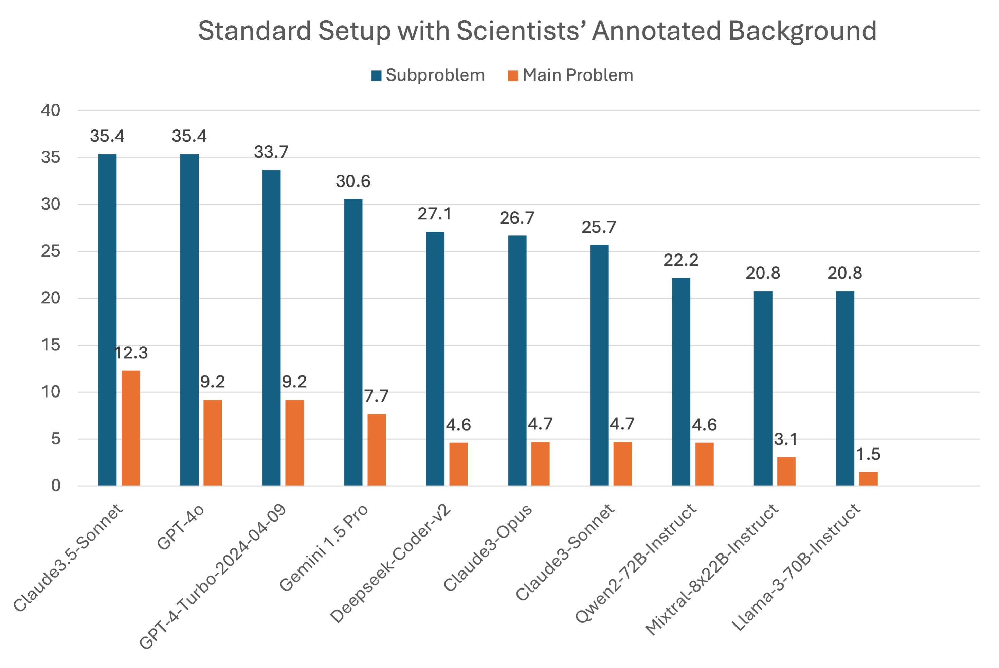
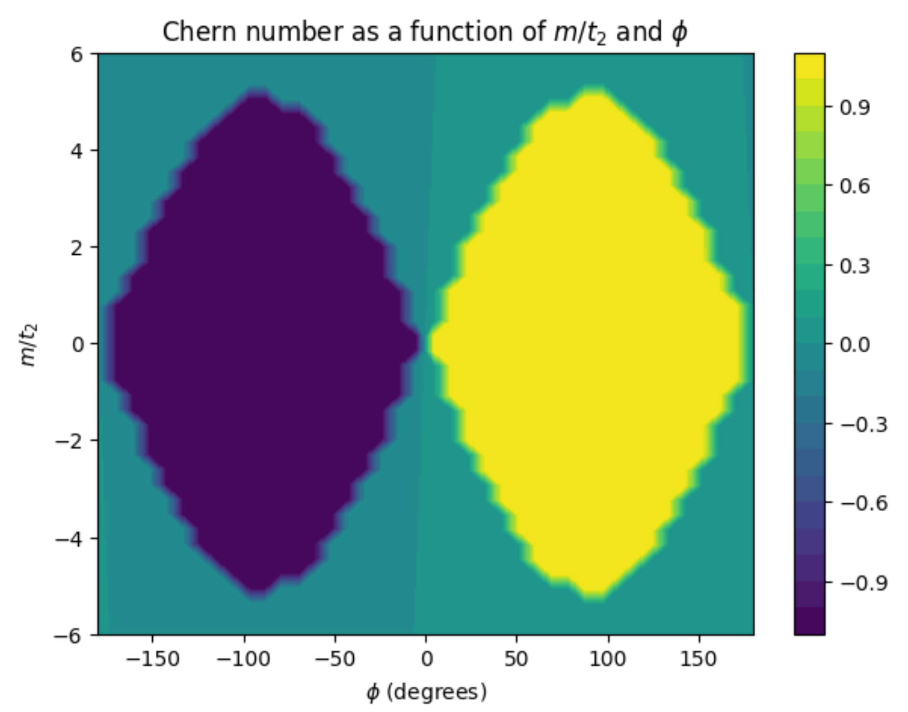
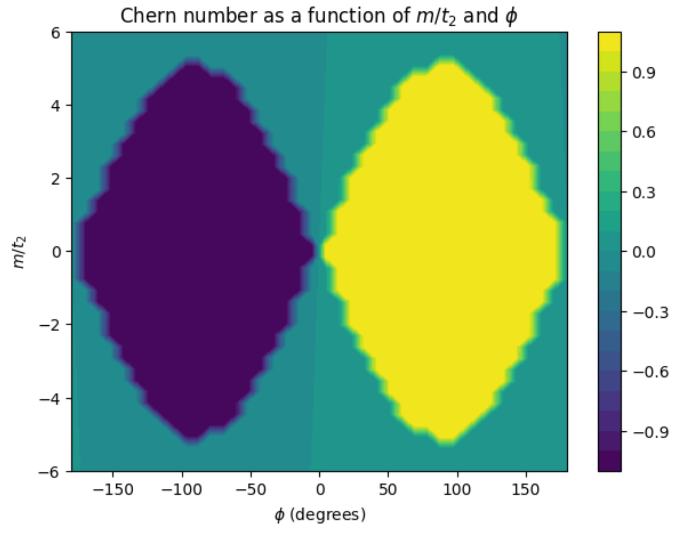

# SciCode: A Research Coding Benchmark Curated by Scientists

<p align="center">
<strong>Minyang Tian<sup>1,2*‡</sup>, Luyu Gao<sup>3*</sup>, Shizhuo Dylan Zhang<sup>1</sup>, Xinan Chen<sup>1†</sup>, Cunwei Fan<sup>1†</sup>, Xuefei Guo<sup>1†</sup>, Roland Haas<sup>1†</sup>, Pan Ji<sup>4†</sup>, Kittithat Krongchon<sup>1†</sup>, Yao Li<sup>1†</sup>, Shengyan Liu<sup>1†</sup>, Di Luo<sup>5,6,11†</sup>, Yutao Ma<sup>7†</sup>, Hao Tong<sup>1†</sup>, Kha Trinh<sup>7†</sup>, Chenyu Tian<sup>8†</sup>, Zihan Wang<sup>1†</sup>, Bohao Wu<sup>1†</sup>, Yanyu Xiong<sup>9†</sup>, Shengzhu Yin<sup>1†</sup>, Minhui Zhu<sup>1†</sup>, Kilian Lieret<sup>10</sup>, Yanxin Lu<sup>1</sup>, Genglin Liu<sup>1</sup>, Yufeng Du<sup>1</sup>, Tianhua Tao<sup>1</sup>, Ofir Press<sup>10</sup>, Jamie Callan<sup>3</sup>, Eliu Huerta<sup>1,2,7‡</sup>, Hao Peng<sup>1‡</sup></strong>
</p>

<p align="center">
<sup>1</sup>University of Illinois Urbana-Champaign  
<sup>2</sup>Argonne National Laboratory  
<sup>3</sup>Carnegie Mellon University  
<sup>4</sup>University of North Carolina at Chapel Hill  
<sup>5</sup>Massachusetts Institute of Technology  
<sup>6</sup>Harvard University  
<sup>7</sup>University of Chicago  
<sup>8</sup>University of Texas at Austin  
<sup>9</sup>Stanford University  
<sup>10</sup>Princeton University  
<sup>11</sup>The NSF AI Institute for Artificial Intelligence and Fundamental Interactions  
</p>

<p align="center">
* Equal contribution lead authors. † Data curation, alphabetical order.
‡ Corresponding to: {mtian8, haopeng}@illinois.edu, elihu@anl.gov
</p>

<div class="grid cards" markdown>

-   :material-book:{ .lg .middle } __Leaderboard__

    ---

    How good are LMs at science, really?

    [:octicons-arrow-right-24: Browse the results](leaderboard.md)

-   :material-book:{ .lg .middle } __Paper__

    ---

    Learn all the details

    [:octicons-arrow-right-24: Read the paper](https://arxiv.com)
</div>


<div class="grid cards" markdown>


-   :material-play:{ .lg .middle } __Installation & usage__

    ---

    Learn how to evaluate your model

    [:octicons-arrow-right-24: Read the docs](docs/index.md)

</div>


## Introduction
SciCode is a challenging benchmark designed to evaluate the capabilities of language models (LMs) in generating code for solving realistic scientific research problems. It has a diverse coverage of **16** subdomains from **6** domains: Physics, Math, Material Science, Biology, and Chemistry. Unlike previous benchmarks that consist of exam-like question-answer pairs, SciCode is converted from real research problems. SciCode problems naturally factorize into multiple subproblems, each involving knowledge recall, reasoning, and code synthesis. In total, SciCode contains **338** subproblems decomposed from **80** challenging main problems, and it offers optional descriptions specifying useful scientific background information and scientist-annotated gold-standard solutions and test cases for evaluation. Claude3.5-Sonnet, the best-performing model among those tested, can solve only **4.6%** of the problems in the most realistic setting. Broadly, SciCode demonstrates a realistic and scientists' everyday workflow of identifying critical science concepts and facts and then transforming them into computation and simulation code. We believe SciCode not only helps demonstrate contemporary LLMs' progress towards helpful assistant for scientists but also helps shed light on future building and evaluation of scientific AI.


## Overview
SciCode sources challenging and realistic research-level coding problems across 6 natural science disciplines, covering a total of 16 subfields. This diverse selection ensures a comprehensive representation of the natural sciences, where extensive code development is essential. SciCode is mainly drawn from the scripts that scientists use in their everyday workflow. Many of these have been used in one or more publications, demonstrating their robustness and correctness.

Among various coding necessities, Scicode mainly focuses on 1. Numerical methods 2.Simulation of systems 3. Scientific calculation. These are the tasks we believe require intense scientific knowledge and reasoning to optimally test LM’s science capability. The below figure is an example of the combination of 1 and 3.

In designing test cases for evaluation, we incorporate domain-specific test cases in addition to numerical cases. These tests are extracted from real scientific workflows: scientists must design domain-specific test cases to verify code accuracy by reproducing results published in papers or matching analytical solutions derived from theoretical models. Each problem goes through **3** rounds of validation (i.e. by in-domain scientists, out-of-domain scientists, GPT4) for quality control.

## Benchmark Statistics

| **Fields**           | **Subfields**                                                                                                 |
|----------------------|---------------------------------------------------------------------------------------------------------------|
| **Mathematics**      | [Numerical Linear Algebra](#numerical-linear-algebra) (8), [Computational Mechanics](#computational-mechanics) (5), [Computational Finance](#computational-finance) (1) |
| **Physics**          | [Condensed Matter Physics](#condensed-matter-physics) (13), [Optics](#optics) (10), [Quantum Information/Computing](#quantum-informationcomputing) (6), [Computational Physics](#computational-physics) (5), [Astrophysics](#astrophysics) (2), [Particle Physics](#particle-physics) (1) |
| **Chemistry**        | [Quantum Chemistry](#quantum-chemistry) (5), [Computational Chemistry](#computational-chemistry) (3)          |
| **Biology**          | [Ecology](#ecology) (6), [Biochemistry](#biochemistry) (1), [Genetics](#genetics) (1)                         |
| **Material Science** | [Semiconductor Materials](#semiconductor-materials) (7), [Molecular Modeling](#molecular-modeling) (6)       |


<p style="text-align: center;">**Left:** Distribution of Main Problems   **Right:** Distribution of Subproblems</p>

## Experiment Results
We evaluate our model using zero-shot prompts. We keep the prompts general and design different ones for different evaluation setups only to inform the model about the tasks. We keep prompts the same across models and fields, and they contain the model’s main and sub-problem instructions and code for previous subproblems. The standard setup means the model is tested without background knowledge and carrying over generated solutions to previous subproblems. The scientists' annotated background provides the necessary knowledge and reasoning steps to solve the problems, shifting the evaluation’s focus more towards the models’ coding and instruction-following capabilities.




## Problem List
### Numerical Linear Algebra
1_Conjugate_Gradient

3_Gauss_Seidel

4_Incomplete_Cholesky

5_Lanczos

9_Weighted_Jacobi

29_Gram_Schmidt_orthogonalization

31_independent_component_analysis

74_Householder_QR

### Computational Mechanics
18_NURBS

24_Burgers_equation

40_Spliting_Operator

54_SUPG

78_Chaotic_Dynamics_Pendulum

### Computational Finance
63_Estimating_Stock_Option_Price

### Condensed Matter Physics
17_linear_tetrahedron_method

20_phonon_angular_momentum

33_phase_diagram_chern_haldane_model

38_Reciprocal_lattice_vector

48_MEELS_conversion

50_Replica_symmetry_breaking

62_dmrg

67_LEG_Dyson_equation_bulk

69_LEG_Dyson_equation_semi_infinite

72_ising_model

73_Xray_conversion_II

75_graphene_tight_binding

### Optics
2_Gaussian_Beam_Focus

6_Spatial_filters_I

7_Spatial_filters_II

8_Spatial_filters_III

14_Brownian_motion_in_the_optical_tweezer

22_Beam_translation_reexpansion

28_Gaussian_Beam_Intensity

32_Multiparticle_dynamics_in_the_optical_tweezer_array

37_ray_optics_spherical_aberration

43_two_end_fiber_laser_generator

### Quantum Information/Computing
11_GADC_entanglement

19_n_tangle

23_Blahut_Arimoto

59_VQE

65_GHZ_protocol_fidelity

71_GADC_rev_coherent_info

### Computational Physics
13_Maxwell_Equation_Solver

15_Crank_Nicolson_for_time_dependent_Schrodinger

45_finite_difference_heat_equation

52_Shooting_algo_H_atom

57_1D_harmonic_oscillator_numerov_shooting

### Astrophysics
49_nbody

58_Tolman_Oppenheimer_Volkoff_star

### Particle Physics
70_neutrino_oscillation

### Quantum Chemistry
12_Schrodinger_DFT_with_SCF

30_helium_slater_jastrow_wavefunction

46_helium_atom_vmc

66_kolmogorov_crespi_potential

68_helium_atom_dmc

### Computational Chemistry
10_ewald_summation

16_Davidson_method

60_Widom_particle_insertion

### Ecology
25_CRM_in_chemostat

26_CRM_in_serial_dilution

41_Structural_stability_in_serial_dilution

53_Stochastic_Lotka_Volterra

55_Swift_Hohenberg

56_temporal_niches

### Biochemistry
44_two_mer_entropy

### Genetics
76_protein_dna_binding

### Semiconductor Materials
21_Absorption_coefficient_for_alloy_GaAlAs

27_Design_trade_offs_for_high_speed_photodetectors

34_PN_diode_band_diagram

35_Quantum_Dot_Absorption_Spectrum

36_Quasi_Fermi_levels_of_photo_resistor_out_of_equilibrium

39_Reflection_spectra_for_a_Distributed_Bragg_Reflector

42_The_threshold_current_for_multi_quantum_well_lasers

### Molecular Modeling
47_Internal_Energy

51_Simple_Molecular_Dynamics

64_GCMC

77_Berendsen_thermostat

79_Nose_Hoover_chain_thermostat

80_Anderson_thermostat

## Example: Calculate Chern numbers for the Haldane Model
### Main Problem and Dependencies
**1. Generate an array of Chern numbers for the Haldane model on a hexagonal lattice by sweeping the following parameters: the on-site energy to next-nearest-neighbor coupling constant ratio ($m/t_2$ from -6 to 6 with $N$ samples) and the phase ($\phi$ from -$\pi$ to $\pi$ with $N$ samples) values. Given the lattice spacing $a$, the nearest-neighbor coupling constant $t_1$, the next-nearest-neighbor coupling constant $t_2$, the grid size $\delta$ for discretizing the Brillouin zone in the $k_x$ and $k_y$ directions (assuming the grid sizes are the same in both directions), and the number of sweeping grid points $N$ for $m/t_2$ and $\phi$.**

``` python
'''
Inputs:
delta : float
    The grid size in kx and ky axis for discretizing the Brillouin zone.
a : float
    The lattice spacing, i.e., the length of one side of the hexagon.
t1 : float
    The nearest-neighbor coupling constant.
t2 : float
    The next-nearest-neighbor coupling constant.
N : int
    The number of sweeping grid points for both the on-site energy to next-nearest-neighbor coupling constant ratio and phase.

Outputs:
results: matrix of shape(N, N)
    The Chern numbers by sweeping the on-site energy to next-nearest-neighbor coupling constant ratio (m/t2) and phase (phi).
m_values: array of length N
    The swept on-site energy to next-nearest-neighbor coupling constant ratios.
phi_values: array of length N
    The swept phase values.
'''
```
```python
# Package Dependencies
import numpy as np
import cmath
from math import pi, sin, cos, sqrt
```
### Subproblems
**1.1 Write a Haldane model Hamiltonian on a hexagonal lattice, given the following parameters: wavevector components $k_x$ and $k_y$ (momentum) in the x and y directions, lattice spacing $a$, nearest-neighbor coupling constant $t_1$, next-nearest-neighbor coupling constant $t_2$, phase $\phi$ for the next-nearest-neighbor hopping, and the on-site energy $m$.**

**_Scientists Annotated Background:_**

Source: Haldane, F. D. M. (1988). Model for a quantum Hall effect without Landau levels: Condensed-matter realization of the" parity anomaly". Physical review letters, 61(18).

We denote $\{\mathbf{a}_i\}$ are the vectors from a B site to its three nearest-neighbor A sites, and $\{\mathbf{b}_i\}$ are next-nearest-neighbor distance vectors, then we have

$$
{\mathbf{a}_1} = (0,a),
$$

$$
{\mathbf{a}_2} = (\sqrt 3 a/2, - a/2),
$$

$$
{\mathbf{a}_3} = ( - \sqrt 3 a/2, - a/2)
$$

$$
{\mathbf{b}_1} = {\mathbf{a}_2} - {\mathbf{a}_3} = (\sqrt 3 a,0),
$$

$$
{\mathbf{b}_2} = {\mathbf{a}_3} - {\mathbf{a}_1} = ( - \sqrt 3 a/2, - 3a/2),
$$

$$
{\mathbf{b}_3} = {\mathbf{a}_1} - {\mathbf{a}_2} = ( - \sqrt 3 a/2,3a/2)
$$

Then the Haldane model on a hexagonal lattice can be written as

$$
H(k) = {d_0}I + {d_1}{\sigma _1} + {d_2}{\sigma _2} + {d_3}{\sigma _3}
$$

$${d_0} = 2{t_2}\cos \phi \sum\nolimits_i {\cos (\mathbf{k} \cdot {\mathbf{b}_i})} = 2{t_2}\cos \phi \left[ {\cos \left( {\sqrt 3 {k_x}a} \right) + \cos \left( { - \sqrt 3 {k_x}a/2 + 3{k_y}a/2} \right) + \cos \left( { - \sqrt 3 {k_x}a/2 - 3{k_y}a/2} \right)} \right]
$$

$$
{d_1} = {t_1}\sum\nolimits_i {\cos (\mathbf{k} \cdot {\mathbf{a}_i})}  = {t_1}\left[ {\cos \left( {{k_y}a} \right) + \cos \left( {\sqrt 3 {k_x}a/2 - {k_y}a/2} \right) + \cos \left( { - \sqrt 3 {k_x}a/2 - {k_y}a/2} \right)} \right]\\
$$

$$
{d_2} = {t_1}\sum\nolimits_i {\sin (\mathbf{k} \cdot {\mathbf{a}_i})}  = {t_1}\left[ {\sin \left( {{k_y}a} \right) + \sin \left( {\sqrt 3 {k_x}a/2 - {k_y}a/2} \right) + \sin \left( { - \sqrt 3 {k_x}a/2 - {k_y}a/2} \right)} \right] \\
$$

$$
{d_3} = m - 2{t_2}\sin \phi \sum\nolimits_i {\sin (\mathbf{k} \cdot {\mathbf{b}_i})}  = m - 2{t_2}\sin \phi \left[ {\sin \left( {\sqrt 3 {k_x}a} \right) + \sin \left( { - \sqrt 3 {k_x}a/2 + 3{k_y}a/2} \right) + \sin \left( { - \sqrt 3 {k_x}a/2 - 3{k_y}a/2} \right)} \right] \\
$$

where $\sigma_i$ are the Pauli matrices and $I$ is the identity matrix.
```python
def calc_hamiltonian(kx, ky, a, t1, t2, phi, m):
    """
    Function to generate the Haldane Hamiltonian with a given set of parameters.

    Inputs:
    kx : float
        The x component of the wavevector.
    ky : float
        The y component of the wavevector.
    a : float
        The lattice spacing, i.e., the length of one side of the hexagon.
    t1 : float
        The nearest-neighbor coupling constant.
    t2 : float
        The next-nearest-neighbor coupling constant.
    phi : float
        The phase ranging from -π to π.
    m : float
        The on-site energy.

    Output:
    hamiltonian : matrix of shape(2, 2)
        The Haldane Hamiltonian on a hexagonal lattice.
    """
```
```python
# test case 1
kx = 1
ky = 1
a = 1
t1 = 1
t2 = 0.3
phi = 1
m = 1
assert np.allclose(calc_hamiltonian(kx, ky, a, t1, t2, phi, m), target)
```
```python
# Test Case 2
kx = 0
ky = 1
a = 0.5
t1 = 1
t2 = 0.2
phi = 1
m = 1
assert np.allclose(calc_hamiltonian(kx, ky, a, t1, t2, phi, m), target)
```
```python
# Test Case 3
kx = 1
ky = 0
a = 0.5
t1 = 1
t2 = 0.2
phi = 1
m = 1
assert np.allclose(calc_hamiltonian(kx, ky, a, t1, t2, phi, m), target)
```
**1.2 Calculate the Chern number using the Haldane Hamiltonian, given the grid size $\delta$ for discretizing the Brillouin zone in the $k_x$ and $k_y$ directions (assuming the grid sizes are the same in both directions), the lattice spacing $a$, the nearest-neighbor coupling constant $t_1$, the next-nearest-neighbor coupling constant $t_2$, the phase $\phi$ for the next-nearest-neighbor hopping, and the on-site energy $m$.**

**_Scientists Annotated Background:_**

Source: Fukui, Takahiro, Yasuhiro Hatsugai, and Hiroshi Suzuki. "Chern numbers in discretized Brillouin zone: efficient method of computing (spin) Hall conductances." Journal of the Physical Society of Japan 74.6 (2005): 1674-1677.


Here we can discretize the two-dimensional Brillouin zone into grids with step $\delta {k_x} = \delta {k_y} = \delta$. If we define the U(1) gauge field on the links of the lattice as $U_\mu (\mathbf{k}_l) := \frac{\left\langle n(\mathbf{k}_l)\middle|n(\mathbf{k}_l + \hat{\mu})\right\rangle}{\left|\left\langle n(\mathbf{k}_l)\middle|n(\mathbf{k}_l + \hat{\mu})\right\rangle\right|}$, where $\left|n(\mathbf{k}_l)\right\rangle$ is the eigenvector of Hamiltonian at $\mathbf{k}_l$, $\hat{\mu}$ is a small displacement vector in the direction $\mu$ with magnitude $\delta$, and $\mathbf{k}_l$ is one of the momentum space lattice points $l$. The corresponding curvature (flux) becomes

$$
F_{xy}(\mathbf{k}_l) := \ln \left[U_x(\mathbf{k}_l)U_y(\mathbf{k}_l+\hat{x})U_x^{-1}(\mathbf{k}_l+\hat{y})U_y^{-1}(\mathbf{k}_l)\right]
$$

and the Chern number of a band can be calculated as

$$
c = \frac{1}{2\pi i} \Sigma_l F_{xy}(\mathbf{k}_l),
$$
where the summation is over all the lattice points $l$. Note that the Brillouin zone of a hexagonal lattice with spacing $a$ can be chosen as a rectangle with $0 \le {k_x} \le k_{x0} = 2\sqrt 3 \pi /(3a),0 \le {k_y} \le k_{y0} = 4\pi /(3a)$.
```python
def compute_chern_number(delta, a, t1, t2, phi, m):
    """
    Function to compute the Chern number with a given set of parameters.

    Inputs:
    delta : float
        The grid size in kx and ky axis for discretizing the Brillouin zone.
    a : float
        The lattice spacing, i.e., the length of one side of the hexagon.
    t1 : float
        The nearest-neighbor coupling constant.
    t2 : float
        The next-nearest-neighbor coupling constant.
    phi : float
        The phase ranging from -π to π.
    m : float
        The on-site energy.

    Output:
    chern_number : float
        The Chern number, a real number that should be close to an integer. The imaginary part is cropped out due to the negligible magnitude.
    """
```

```python
# test case 1
delta = 2 * np.pi / 200
a = 1
t1 = 4
t2 = 1
phi = 1
m = 1
assert np.allclose(compute_chern_number(delta, a, t1, t2, phi, m), target)
```

```python
# test case 2
delta = 2 * np.pi / 100
a = 1
t1 = 1
t2 = 0.3
phi = -1
m = 1
assert np.allclose(compute_chern_number(delta, a, t1, t2, phi, m), target)
```

```python
# test case 3
delta = 2 * np.pi / 100
a = 1
t1 = 1
t2 = 0.2
phi = 1
m = 1
assert np.allclose(compute_chern_number(delta, a, t1, t2, phi, m), target)
```

**1.3 Make a 2D array of Chern numbers by sweeping the parameters: the on-site energy to next-nearest-neighbor coupling ratio ($m/t_2$ from -6 to 6 with $N$ samples) and phase ($\phi$ from -$\pi$ to $\pi$ with $N$ samples) values. Given the grid size $\delta$ for discretizing the Brillouin zone in the $k_x$ and $k_y$ directions (assuming the grid sizes are the same in both directions), the lattice spacing $a$, the nearest-neighbor coupling constant $t_1$, and the next-nearest-neighbor coupling constant $t_2$.**
```python
def compute_chern_number_grid(delta, a, t1, t2, N):
    """
    Function to calculate the Chern numbers by sweeping the given set of parameters and returns the results along with the corresponding swept next-nearest-neighbor coupling constant and phase.

    Inputs:
    delta : float
        The grid size in kx and ky axis for discretizing the Brillouin zone.
    a : float
        The lattice spacing, i.e., the length of one side of the hexagon.
    t1 : float
        The nearest-neighbor coupling constant.
    t2 : float
        The next-nearest-neighbor coupling constant.
    N : int
        The number of sweeping grid points for both the on-site energy to next-nearest-neighbor coupling constant ratio and phase.

    Outputs:
    results: matrix of shape(N, N)
        The Chern numbers by sweeping the on-site energy to next-nearest-neighbor coupling constant ratio (m/t2) and phase (phi).
    m_values: array of length N
        The swept on-site energy to next-nearest-neighbor coupling constant ratios.
    phi_values: array of length N
        The swept phase values.
    """
```

### Domain Specific Test Cases
**Both the $k$-space and sweeping grid sizes are set to very rough values to make the computation faster, feel free to increase them for higher accuracy.**

**At zero on-site energy, the Chern number is 1 for $\phi > 0$, and the Chern number is -1 for $\phi < 0$.**

**For complementary plots, we can see that these phase diagrams are similar to the one in the original paper: Fig.2 in [Haldane, F. D. M. (1988)](https://journals.aps.org/prl/abstract/10.1103/PhysRevLett.61.2015). To achieve a better match, decrease all grid sizes.**


**Compare the following three test cases. We can find that the phase diagram is independent of the value of $t_1$, and the ratio of $t_2/t_1$, which is consistent with our expectations.**

```python
# Test Case 1
delta = 2 * np.pi / 30
a = 1.0
t1 = 4.0
t2 = 1.0
N = 40
```


```python
# Test Case 2
delta = 2 * np.pi / 30
a = 1.0
t1 = 5.0
t2 = 1.0
N = 40
```


```python
# Test Case 3
delta = 2 * np.pi / 30
a = 1.0
t1 = 1.0
t2 = 0.2
N = 40
```


